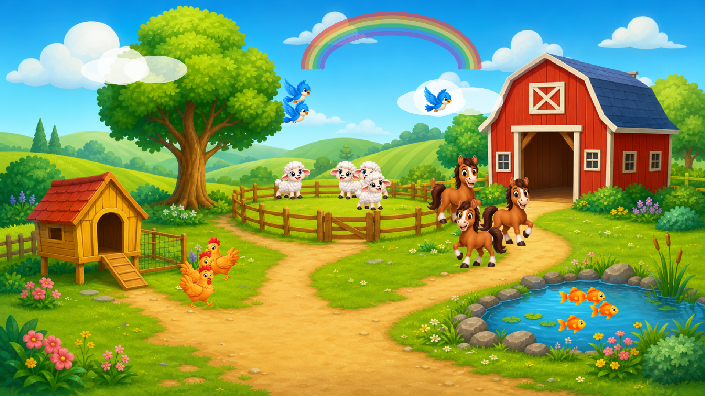

# LKids

LKids é uma brincadeira interativa em tela cheia com tema de fazendinha. Clique nas áreas da cena ou use o teclado e o controle para soltar animais, pássaros e peixes, com sons e pequenas animações.

## Conheça a fazendinha

Uma brincadeira visual para explorar: clique no cenário, solte animais e descubra sons e pequenas animações.

## Versão 1.0.1

Edição Fazendinha com identidade visual padronizada: o aplicativo, os atalhos e o instalador usam o ícone oficial do LKids.

A versão 1.0.0 continua disponível no histórico de lançamentos.

## Como executar pelo código

1. Instale o Python 3.11 ou superior.
2. Execute `pip install -r requirements.txt`.
3. Execute `python main.py`.

Para fechar o aplicativo, use `Ctrl + Shift + Q`.

## Privacidade

O LKids não coleta dados pessoais nem exige cadastro.
